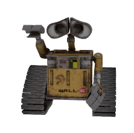

# PET Autonet

O PET (Programa de Educação Tutorial) é uma iniciativa que visa promover a formação acadêmica, profissional e cidadã dos estudantes universitários. O programa é composto por grupos de estudantes que desenvolvem atividades de ensino, pesquisa e extensão em diversas áreas do conhecimento, com o apoio de um tutor professor.

---

## Quem pode participar

O PET Autonet é formado por estudantes de graduação do IFMT, selecionados por meio de processo seletivo aberto, sob orientação de um professor tutor.

Você pode ficar por dentro quando abrir o processo seletivo por meio do nosso [Instagram (@pet.autonet)](https://instagram.com/pet.autonet).

---

    <h3>Acompanhe as nossas redes sociais!</h3>
    

      
      
    

---

    

        
    

     
    
Seja bem-vindo(a) ao PET Autonet!

